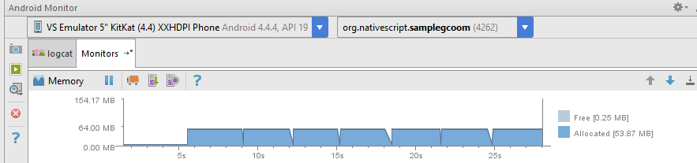

# Memory management in NativeScript for Android

## Overview
The purpose of this project is to demonstrate some of the internal workings of the current (<= ver. 2.2.0) NativeScript for Android runtime. Please note that the described behavior may change in future.

## Details
Every NativeScript for Android app is comprised of two managed heaps - one for Java (Dalvik/ART VM) and another for JavaScript (V8). Every time when the app executes JavaScript code as follows
```JavaScript
var file = new java.io.File("somefile");
```
it creates two objects - one in the JavaScript heap and another in the Java heap. The JavaScript object serves only as a proxy to the "real" Java object. Thus the size of the JavaScript object is very small. Suppose the app has to execute the following line
```JavaScript
var success = file.delete();
```
The only information we need is some sort of `id` in order to find the corresponding Java object and call `delete()` on it. Currently we use `int32` for the `id`. So practically, we can think of `file` as
```JavaScript
var file = { javaObjectId: 123 };
```
if the actual `id` has value `123`. In other worlds, creating JavaScript objects is very cheap.

Having said that, this could lead to some scenarios where there are unreachable JavaScript objects (e.g. effective garbage) for which the corresponding Java objects allocated a lot of memory (think `Bitmap`, `String`, `StringBuilder`, I/O buffers, etc.). But because there is no memory pressure in the JavaScript heap there is no reason for V8 GC to kick off. Therefore NativeScript for Android runtime doesn't have the chance to release the Java object handles (if any). This could cause `OutOfMemoryError`. In order to mitigate such issues we expose global `gc()` function which triggers JavaScript GC.

You can take a look at [app/main-view-model.js](app/main-view-model.js)
The following screenshot demonstrates the memory allocation without calling `gc()`.

The following screenshot demonstrates the memory allocation with calling `gc()`.
